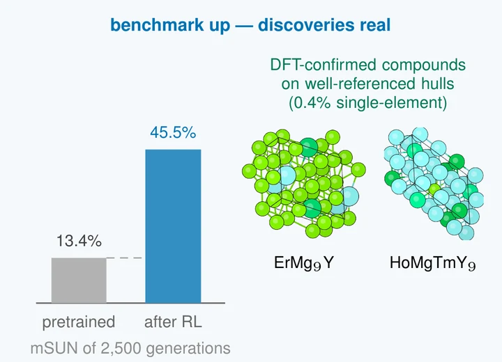

# paprakash.github.io

Personal research website of Pawan Prakash. Plain HTML and CSS, no build step. GitHub Pages serves the files as they are.

```
index.html              the whole page
assets/css/style.css    all styling (colors are defined at the top)
assets/img/pawan.jpg    headshot (640 x 640)
assets/img/pubs/        publication thumbnails
assets/img/favicon.svg  browser-tab icon
cv.pdf                  public CV (no phone number, no references)
.nojekyll               tells GitHub Pages not to run Jekyll
```

## Editing

Every edit can be made on github.com. Open the file, click the pencil icon, change it, and commit. The live site updates within a minute or two.

**Add a news item.** In `index.html`, find `<ul class="news">` and copy one `<li>` line to the top of the list.

**Add a publication.** Copy one `<article class="pub">...</article>` block and edit it. Use `class="pub first"` for first-author papers (tinted background). Put your name in `<span class="me">P. Prakash</span>` so it shows in bold. Thumbnails go in `assets/img/pubs/`; any image works, and figures with a white background look best.

**Replace the OMatGRPO tile with a figure.** Once the paper is public, replace

```html
<div class="pub-thumb tile" aria-hidden="true"><span>OMatGRPO<small>Under review</small></span></div>
```

with

```html
<a class="pub-thumb" href="PAPER_URL" aria-hidden="true" tabindex="-1">
  
</a>
```

and add the Paper / arXiv / Code links in a `<ul class="plinks">` like the other entries.

**Update the CV.** Export a public version from Overleaf (leave out the phone number and references), name it `cv.pdf`, and upload it over the old one.

**Change the accent color.** Edit `--accent` in `assets/css/style.css`, once for light mode at the top and once in each dark-mode block.

## Preview on your computer

Open `index.html` in a browser. Everything works locally except the web fonts when offline.
